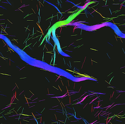

# C-GLASS

A **C**oarse-**G**rained **L**iving **A**ctive **S**ystem **S**imulator

[](https://travis-ci.com/Betterton-Lab/C-GLASS)

[](https://doi.org/10.5281/zenodo.3841613)



## Installation

### Building from source (Arch)

#### Install dependencies

C-GLASS dependencies on arch

```
cmake
libgsl-dev --> gsl
libopenmpi-dev --> openmpi
libfftw3-dev --> fftw
libyaml-cpp-dev --> yaml-cpp
libboost-math-dev --> boost-libs
g++ --> gcc
libarmadillo-dev --> armadillo
pkg-config --> pkgconf
libglfw3-dev --> glfw-x11
libglew-dev --> glew
libxi-dev --> libxi
libxcursor-dev --> libxcursor
libxinerama-dev --> libxinerama
```

<!-- ```bash
sudo pacman -S \
clang \
cmake \
gsl \
openmpi \
fftw \
yaml-cpp \
boost-libs \
gcc \
pkgconf \
glfw \
glew \
boost
``` -->

```bash
sudo pacman -S \
glew \
glfw \
yaml-cpp \
boost
```

From aur:
```bash
yay -S armadillo 
```

#### Clone C-GLASS repository

Need to use `--recursive` to clone submodules (e.g. `extern/KMC`)

```bash
git clone --recursive git@github.com:wlough/C-GLASS.git
```

#### Fix miscellaneous errors and run install script

To install without graphics:

```bash
cd C-GLASS
./install.sh
```

To install with graphics:

```bash
cd C-GLASS
./install.sh -g
```

##### Compilation error in logger.cpp

If you see the error

```bash
[ 49%] Building CXX object src/CMakeFiles/cglass.dir/logger.cpp.o
/home/wlough/git/C-GLASS/src/logger.cpp: In static member function ‘static void Logger::Error(const char*, ...)’:
/home/wlough/git/C-GLASS/src/logger.cpp:128:3: error: ‘exit’ was not declared in this scope
  128 |   exit(1);
      |   ^~~~
/home/wlough/git/C-GLASS/src/logger.cpp:2:1: note: ‘exit’ is defined in header ‘<cstdlib>’; did you forget to ‘#include <cstdlib>’?
    1 | #include "cglass/logger.hpp"

```

add the `#include <cstdlib>` directive at the top of the `C-GLASS/src/logger.cpp`:

```C
#include <cstdlib>  // add this line

#include "cglass/logger.hpp"

/****************************/
/******** SINGLETON *********/
/****************************/
...
```

##### Help CMake find glew

If you see the error

```bash
CMake Error at src/CMakeLists.txt:23 (find_package):
  By not providing "Findglew.cmake" in CMAKE_MODULE_PATH this project has
  asked CMake to find a package configuration file provided by "glew", but
  CMake did not find one.

  Could not find a package configuration file provided by "glew" with any of
  the following names:

    glewConfig.cmake
    glew-config.cmake

  Add the installation prefix of "glew" to CMAKE_PREFIX_PATH or set
  "glew_DIR" to a directory containing one of the above files.  If "glew"
  provides a separate development package or SDK, be sure it has been
  installed.
```

then try renaming

`C-GLASS/.CMake_Modules/FindGLEW.cmake`

file to

`C-GLASS/.CMake_Modules/Findglew.cmake`

Another option is to replace `find_package(glew REQUIRED)` with `find_package(GLEW REQUIRED)` in `C-GLASS/src/CMakeLists.txt`


## Running C-GLASS

The C-GLASS executable is run as

```
cglass.exe [optional-flags] [parameter-file] 
```

The following flags are available:

```
--help, -h
    Show the help menu which gives short descriptions about each of the flags
    as well as binary usage
 
 --run-name rname, -r rname 
    Overwrites the parameter "run_name" with rname which serves as a prefix for
    all outputs 

--n-runs num, -n num
    Overwrites the parameter "n_runs" with num, which tells the simulation how
    many times to run the given parameter set with different random number
    generator seeds.

--movie, -m
    Uses the parameters file params_file to load any output files that were
    generated from previous runs of the simulation to replay the graphics and
    record the frames as bitmaps into the directory specified with the
    "movie_directory" parameter

--analysis, -a
    Loads posit/spec files into the simulation for analysis in the same manner
    as the movie flag

-reduce reduce_factor, -R reduce_factor
    Reads in output files and writes new output files that are smaller by a
    factor of reduce_factor, effectively reducing time resolution of output
    data.

--load, -l
    Specifies to load any checkpoint files corresponding to the given parameter
    file, which can be used to continue a simulation that ended prematurely.
    New simulation will be given the name old_simulation_name_reload00n where n
    is the number of reloads performed on that simulation.

--with-reloads, -w
    If running analyses or making movies, C-GLASS will look for parameter files
    that have the same run name but with the reload00n addendum and attempt to
    open the corresponding output files whenever it reached EOF while reading
    an output file.

--blank, -b
    Generates all relevant parameter files using the SimulationManager without
    running the simulations. Useful for generating many parameter files from
    parameter sets (discussed below) and deploying simulations on different
    processors and/or machines.

--auto-graph, -G
    By default, C-GLASS will wait for the user to press the ESC key in the
    OpenGL graphics window before starting to run the simulation. Providing
    this flag will cause the simulation to begin immediately without user
    input. Goes great with the -m flag for creating multiple movies without
    input from the user.
```

```
/path/to/C-GLASS/build/src/executable/cglass.exe cut7_crosslinking.yaml
```

## Parameter files

All parameters used in the simulation, along with their default values and data types, are specified in the `default_config.yaml` file in the `config` folder.

The parameter file is a YAML file and looks like:

```yaml
global_param_1: gp1_value
global_param_2: gp2_value
species:
    global_species_param_1: gsp1_value
    global_species_param_2: gsp2_value
specific_species_name:
    species_param_1: sp1_value
    species_param_2: sp2_value
```

See the `examples` folder for examples of parameter files.

Notice that there are three parameter types: global parameters, global species parameters, and species parameters. Global parameters are parameters that are common to the entire system, such system size, integration time step, etc. Species parameters are unique to the specified species, such as `filament`. There is also an optional global species parameter type that affects every species, such as the frequency to write to output files.

What do I mean by species? C-GLASS assumes that any given simulation will likely have many copies of one kind of thing, which I call a species, perhaps interacting with other species of other kinds. In a system of interacting spheres, the species is 'sphere.' In a system of interacting semiflexible filaments, the species is 'filament.' Simulations can have many types of species all interacting with each other with different species-species interaction potentials.
 
If any parameter is not specified in the parameter file, any instance of that parameter in the simulation will assume its default value specified in the `config/default_config.yaml` file.

Some important global parameters are:

```
seed
    simulation seed to use with random number generator 
run_name
    prefix for all output files
n_runs
    number of individual runs of each parameter type
n_random
    number of samples from a random parameter space (see more below)
n_dim
    number of dimensions of simulation
n_periodic
    number of periodic dimensions of simulation
delta   
    simulation time step
n_steps
    total number of steps in each simulation
system_radius
    "box radius" of system
graph_flag
    run with graphics enabled
n_graph
    how many simulation steps to take between updating graphics
movie_flag
    whether to record the graphics frames into bitmaps
movie_directory
    local directory used to save the recorded bitmaps
thermo_flag
    whether to output thermodynamics outputs (stress tensors, etc)
n_thermo
    how often to output the thermodynamics outputs
potential_type
    can be 'wca' or 'soft' for now
```

Some important global species parameters are:

```
num
    how many to insert into system
insertion_type
    how to insert object into system (e.g. random)
overlap
    whether species can overlap at initiation
draw_type
    (orientation, fixed, or bw) how to color the object
color
    a double that specifies the RGB value of the object
posit_flag
    whether to output position files
n_posit
    how often to output position files
spec_flag
    whether to output species files
n_spec
    how often to output species files
checkpoint_flag
    whether to output checkpoint files
n_checkpoint
    how often to output checkpoint files
```

### Anchor parameters
C-GLASS has the capability to independently control crosslinker and motor protein anchor parameters. Anchor parameters are controlled within the Crosslink map in the input Yaml file:

```yaml
Crosslink:
  # other crosslink params here
  Anchors:
     - velocity_s: 50
       color: 3.5
     - color: 4.5
```

Only two anchors are permitted per crosslinker or motor protein. The anchor parameters obey the following rules when parameters are left blank:

- If no anchors are listed, the anchor parameters will both be set to default.
- If one anchor is listed, the other anchor will copy its parameters. Any unlisted parameters will be set to default.
- If two anchors are listed, and one anchor has a parameter that the other doesn't, the one that doesn't have the parameter will copy the parameter from the other.

In the above example, Anchor 1 will have velocity_s=50, velocity_d=0 (default), color=3.5, and Anchor 2 will have velocity_s=50 (copied), velocity_d=0 (default), color=4.5.

## Advanced usage

### Running unit tests

One may run C-GLASS's unit tests by passing `-DTESTS=TRUE` to CMake

```bash
mkdir build
cd build
cmake -DTESTS=TRUE ..
make
make test
```

### Adding new parameters

C-GLASS comes with it's own parameter initialization tool, `configure_C-GLASS.exe`, which is installed automatically along with the C-GLASS binary using CMake. The configurator makes it easy to add new parameters to the simulation without mucking around in the source code. Just add your new parameter to `config/default_config.yaml` file using the following format: 

```
new_parameter_name: [default_parameter_value, parameter_type] 
```
 
Then run the configurator using

```
./configure_cglass.exe config/default_config.yaml
```

Running configure_cglass.exe will look at all the parameters in the default config file and add them seamlessly to the proper C-GLASS headers, and you can begin using them after recompiling C-GLASS using CMake.

### Parameter sets

Using parameter sets, it becomes easier to run many simulations over a given parameter space. There are two types of parameter sets possible with C-GLASS: defined and random. Each parameter set type works the same with both global parameters and species parameters.

#### Defined parameter sets
  
Defined parameter sets are specified by the `V` prefix in the parameter file:

```
seed: 4916819461895
run_name: defined_set
n_runs: N
parameter_name1: param_value1
parameter_name2: [V, param_value2, param_value3]
parameter_name3: [V, param_value4, param_value5]
```

Parameters specified in this way (as lists of parameters) will be iterated over until every possible combination of parameters has been run. In this example, C-GLASS will run N simulations each of the following 4 parameter sets:

```
seed: random_seed_1
run_name: defined_set_v000
n_runs: N
parameter_name1: param_value1
parameter_name2: param_value2
parameter_name3: param_value4

seed: random_seed_2
run_name: defined_set_v001
n_runs: N
parameter_name1: param_value1
parameter_name2: param_value2
parameter_name3: param_value5

seed: random_seed_3
run_name: defined_set_v002
n_runs: N
parameter_name1: param_value1
parameter_name2: param_value3
parameter_name3: param_value4

seed: random_seed_4
run_name: defined_set_v003
n_runs: N
parameter_name1: param_value1
parameter_name2: param_value3
parameter_name3: param_value5
```

#### Random parameter sets

Random parameter sets are designed specifically to be used with polynomial-chaos theory for n-dimensional parameter spaces for large n. Random sets are used in the following way:

```
seed: 2546954828254
n_runs: N
n_random: M
parameter_name1: param_value1
parameter_name2: [R, A, B] # sets to random real in range (A,B)
parameter_name3: [RINT, C, D] # sets to random int in range [C,D]
parameter_name4: [RLOG, F, G] # sets to 10^K for rand real K in range (F,G)
```

Given this parameter file, C-GLASS will run N simulations each of M random parameter sets. The random parameter sets are generated in ranges specified in the lists that are prefixed by the R, RINT, RLOG options.

In this example, the sampled parameter space has dimensionality of n=3, since there are only three parameters we are sampling over. Each parameter set will have a random real number for parameter_name2 in the the range (A,B), a random integer in the range [C,D] for parameter_name3, and will set parameter_name4 to 10^K for random real number K in the range (F,G).  C-GLASS will then run each parameter set N times each with a unique seed, and repeat this random process M times. It will therefore take N samples of M random points in the n-dimensional parameter space.  

### Interactions
  
The Interaction Manager in C-GLASS was written with short-range interactions in mind. For this reason, interactions are treated by considering pair-wise interactions between neighboring interactor-elements that make up a composite object (e.g. small, rigid segments that compose a flexible filament). For this reason, interactions use cell lists to improve performance. Furthermore, simulating large objects in C-GLASS requires representing the object as a composite of smaller, simple objects. An example of how a large object should be decomposed into simple objects is done in the Filament class.

### Potentials
  
C-GLASS is designed to be able to use interchangable potentials for various objects. However, potentials need to be added manually as a subclass of PotentialBase, included in PotentialManager, and a corresponding potential_type added to definitions.h for lookup purposes (see the InitPotentials method in PotentialManager.h for examples).

### Outputs
  
C-GLASS has four output types. Three are species specific (posit, spec, checkpoint), and the fourth is the statistical information file (thermo). All files are written in binary.

The posit file has the following header format:

```
int n_steps, int n_posit, double delta 
```

Followed by n_steps/n_posit lines of data with the format:

```
double position[3]
double scaled_position[3]
double orientation[3]
double diameter
double length
```

Where the scaled position is position mapped into the periodic coordinate space. The position itself gives the particle trajectory over time independent of periodicity.  

The spec file is a custom output file for each species, and can have the same information as the posit file or additional information if needed.

The checkpoint file is almost a copy of the spec file, except it also contains the random number generator information and is overwritten every n_checkpoint steps in the simulation. It can therefore be used to resume a simulation that ended prematurely.

The thermo file contains the following header information:

```
int n_steps, int n_thermo, double delta, int n_dim
```

followed by n_steps/n_thermo lines of data in the following format:

```
double unit_cell[9]
double pressure_tensor[9]
double pressure
double volume
```

Where the pressure is the isometric pressure, and the pressure tensor is calculated from the time-averaged stress tensor.

### Data analysis
  
If analysis operations of output files are already defined for your species, as is the case for the Filament species, analyzing outputs is a simple matter. First, make sure the desired analysis flag is set in the species parameters for that species.

For example, in the Filament species there is a persistence length analysis that produces .mse2e files that tracks the mean-square end-to-end distance of semiflexible filaments. This is triggered by a parameter lp_analysis=1, which can be set in the parameter file.

Anaylses are run by running C-GLASS in the following way:
  
```
cglass.exe -a parameter_file.yaml.
```
  
NOTE: It is important to keep in mind that the parameter_file should be identical to the parameter file used to generate the outputs. There are a few exceptions that only affect post-processing, such as analysis flags, but this is true in general.

The way inputs and outputs are meant to work in C-GLASS is such that during a simulation, output data are generated in the posit, spec, and checkpoint formats, and during analysis, the same output data are read back into the data structures in C-GLASS for processing. The .posit files just contain bare-bones information that allow many types of simple analyses, but .spec files should in general contain all the necessary information to recreate the trajectory for a member of a species. 

For a new species analysis method, the analysis routines should be defined in the species container class, rather than the species member class, and called by the inherited RunAnalysis method of the SpeciesBase class (and likewise for analysis initialization and finalization, see examples for details).

For example, the RunSpiralAnalysis routine is called by the RunAnalysis method in FilamentSpecies, which uses the Filament .spec file as an input to do the necessary analysis, whose results are placed into a new file ending in filament.spiral. See Filament and FilamentSpecies for examples of how analyses can be initialized, processed, etc.

## Directory structure
The directory structure is as follows:

```
C-GLASS
├── include
│   └── cglass
│       └── (header files)
├── src
│   ├── CMakeLists.txt
│   ├── executable
│   │   ├── CMakeLists.txt
│   │   └── cglass_main.cpp
│   ├── configurator
│   │   ├── CMakeLists.txt
│   │   └── configurator.cpp
│   └── (source files)
├── config
│   └── default_config.yaml
├── analysis
│   └── (Python analysis files)
├── scripts
│   └── (utility files)
├── examples
│   └── (parameter file examples)
├── docker
│   └── Dockerfile
├── extern
│   └── KMC
├── tests
│   ├── CMakeLists.txt
│   ├── catch2
│   │   └── catch.hpp
│   └── (C-GLASS unit tests)
├── docs
│   ├── CMakeLists.txt
│   └── main.md
├── figs
│   └── (example simulation figures)
├── README.md
├── LICENSE
├── CMakeLists.txt
├── install.sh
├── launch_docker.sh
├── .travis.yml
└── .gitignore
```

## About C-GLASS

C-GLASS is written in C++ and designed for general coarse-grained physics simulations of active living matter, produced with modularity and scalability in mind. All objects in the simulation are representable as a composite of what I call "simple" objects (points, spheres, rigid cylinders, and 2d polygon surfaces would all qualify). For short-range interactions, C-GLASS uses cell and neighbor lists for improved performance and OpenMP for parallelization.

## License

This software is licensed under the terms of the BSD-3 Clause license. See the `LICENSE` for more details.
